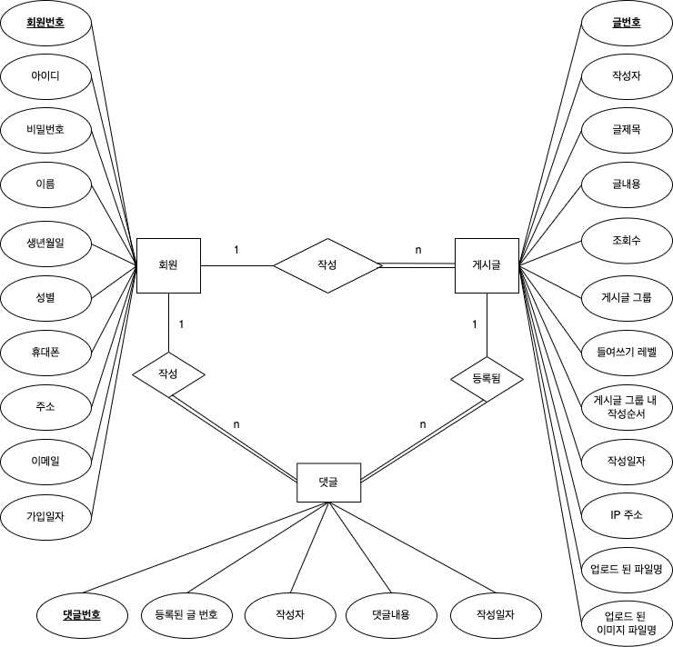
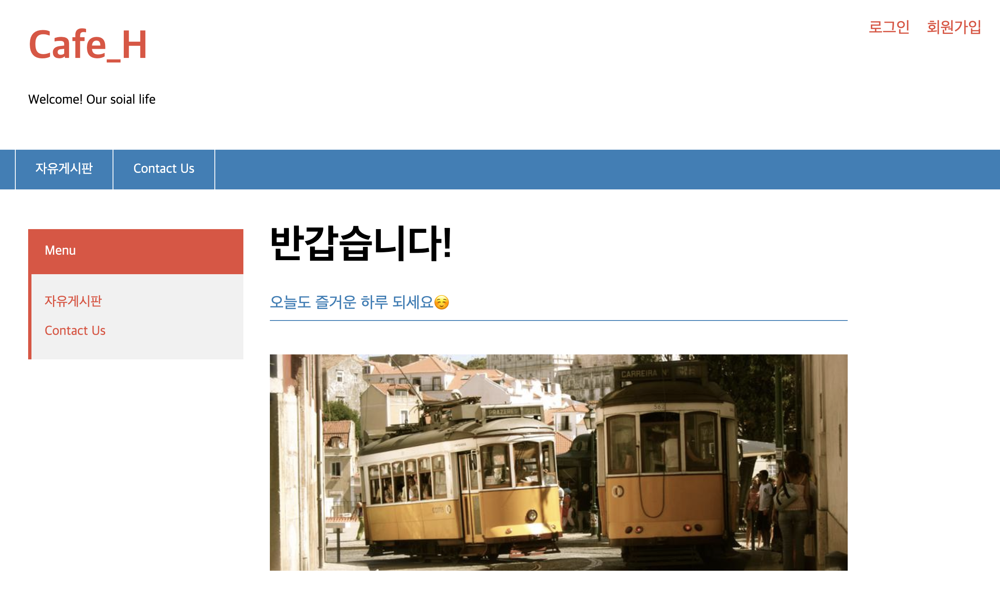

# Project-Cafe
* 커뮤니티 웹 사이트
* 기간 : 2022.03.04 ~ 2022.04.06
* 환경 : Apache Tomcat 8.5, Chrome 브라우저
* 주제 : 커뮤니티 사이트
* 개발 : Eclipse 2021-12, MySQL Workbench 8.0.19
* 사용 언어 : JAVA(JDK 1.8), MySQL8, HTML5, CSS3, JavaScript, JSP & Servlet
* 사용 기술 : MVC Model2, jQuery, Ajax, Open API(다음 우편번호, JAVA 메일)
* 디자인 프레임워크 : Bootstrap
* [프로젝트 요약 문서](https://github.com/miro7923/Project-Cafe/blob/main/portfolio_YujinHwang.pdf)

# 프로젝트 상세내용
## 주제
```
* 다음카페를 모티브로 한 커뮤니티 사이트
```

## 목적
```
* JAVA Servlet을 활용한 웹 사이트 제작 실습
* 회원 관리 기능과 게시판 CRUD 기능 제작 실습
```

## 구현 목표
* 회원
```
* 회원가입과 로그인을 통해 게시글 작성, 수정, 삭제 가능
* 게시글 목록과 본문 조회 가능
* 게시글에 댓글 달기 가능
```

* 관리자
```
* 가입된 회원 목록과 작성된 게시글 목록 조회 가능
* 회원 일괄 탈퇴, 게시글 일괄 삭제 가능
```

## ERD 다이어그램

<p align="center"></p><br>

## 구동 화면
* 메인 페이지

<p align="center"></p><br>

## 개발 일지
* [1. 페이지 템플릿 세팅 및 서블릿 매핑](https://miro7923.github.io/project%20log/cafe-project-01/)
* [2. DB 테이블 만들기](https://miro7923.github.io/project%20log/cafe-project-02/)
* [3. 회원가입 기능 만들기](https://miro7923.github.io/project%20log/cafe-project-03/)
* [4. 회원가입 유효성 검사하기](https://miro7923.github.io/project%20log/cafe-project-04/)
* [5. 회원가입 유효성 검사 구현 완료](https://miro7923.github.io/project%20log/cafe-project-05/)
* [6. 휴대폰 인증기능 구현](https://miro7923.github.io/project%20log/cafe-project-06/)
* [7. 로그인 기능 구현](https://miro7923.github.io/project%20log/cafe-project-07/)
* [8. 회원 정보 수정 기능 구현](https://miro7923.github.io/project%20log/cafe-project-08/)
* [9. 회원 탈퇴 기능 구현](https://miro7923.github.io/project%20log/cafe-project-09/)
* [10. 게시판 만들기 시작](https://miro7923.github.io/project%20log/cafe-project-10/)
* [11. 회원만 게시판 글 쓸 수 있게 하기](https://miro7923.github.io/project%20log/cafe-project-11/)
* [12. 게시판 글쓰기 기능 만들기](https://miro7923.github.io/project%20log/cafe-project-12/)
* [13. 게시글 조회 기능 만들기](https://miro7923.github.io/project%20log/cafe-project-13/)
* [14. 게시글 수정 기능 구현](https://miro7923.github.io/project%20log/cafe-project-14/)
* [15. 게시글 삭제 기능 구현](https://miro7923.github.io/project%20log/cafe-project-15/)
* [16. 답글 작성 기능 구현](https://miro7923.github.io/project%20log/cafe-project-16/)
* [16-1. 게시판 답글 작성 알고리즘](https://miro7923.github.io/project%20log/cafe-project-16_1/)
* [17. 메인 화면에서 최신글 미리보기 기능 추가](https://miro7923.github.io/project%20log/cafe-project-17/)
* [18. 우편번호 검색 기능 추가](https://miro7923.github.io/project%20log/cafe-project-18/)
* [19. 메일 보내기 기능 추가](https://miro7923.github.io/project%20log/cafe-project-19/)
* [20. 파일업로드 기능 추가](https://miro7923.github.io/project%20log/cafe-project-20/)
* [21. 게시물에 첨부된 이미지와 파일 다른 경로에 저장하기](https://miro7923.github.io/project%20log/cafe-project-21/)
* [22. 게시판 이미지 썸네일 보여주는 기능 추가](https://miro7923.github.io/project%20log/cafe-project-22/)
* [23. 댓글 달기 기능 추가](https://miro7923.github.io/project%20log/cafe-project-23/)
* [24. 댓글 수정 기능 추가](https://miro7923.github.io/project%20log/cafe-project-24/)
* [25. 댓글 삭제 기능 추가](https://miro7923.github.io/project%20log/cafe-project-25/)
* [26. 관리자 페이지 + 회원 관리 기능 추가](https://miro7923.github.io/project%20log/cafe-project-26/)
* [27. 관리자 페이지에서 회원 상세정보 보기 기능 추가](https://miro7923.github.io/project%20log/cafe-project-27/)
* [28. 관리자 페이지에서 게시글 관리 기능 추가](https://miro7923.github.io/project%20log/cafe-project-28/)
* [29. 파일업로드 기능 수정(중복파일명 처리)](https://miro7923.github.io/project%20log/cafe-project-29/)
* [글 내용 수정할 때 첨부파일이 사라지는 문제](https://miro7923.github.io/errorlog/warning-log-04/)
* [글 내용 수정할 때 첨부파일이 사라지는 문제2](https://miro7923.github.io/errorlog/warning-log-05/)
* [30. AWS로 프로젝트 배포하기 1. war파일 배포](https://miro7923.github.io/project%20log/cafe-project-30/)
* [31. AWS로 프로젝트 배포하기 2. RDS 연결](https://miro7923.github.io/project%20log/cafe-project-31/)
